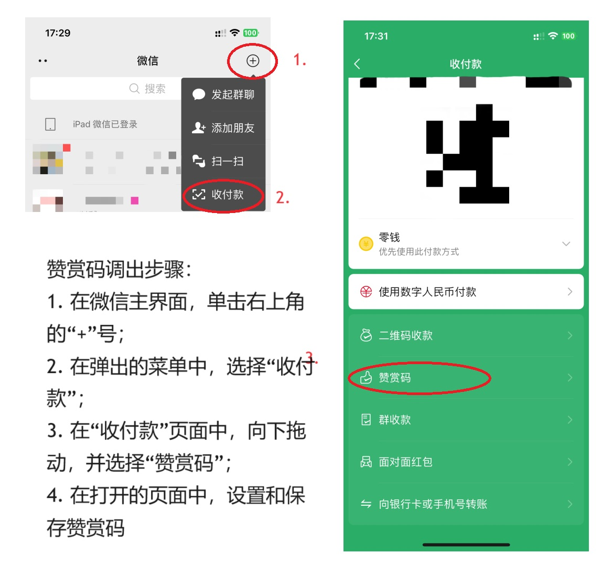
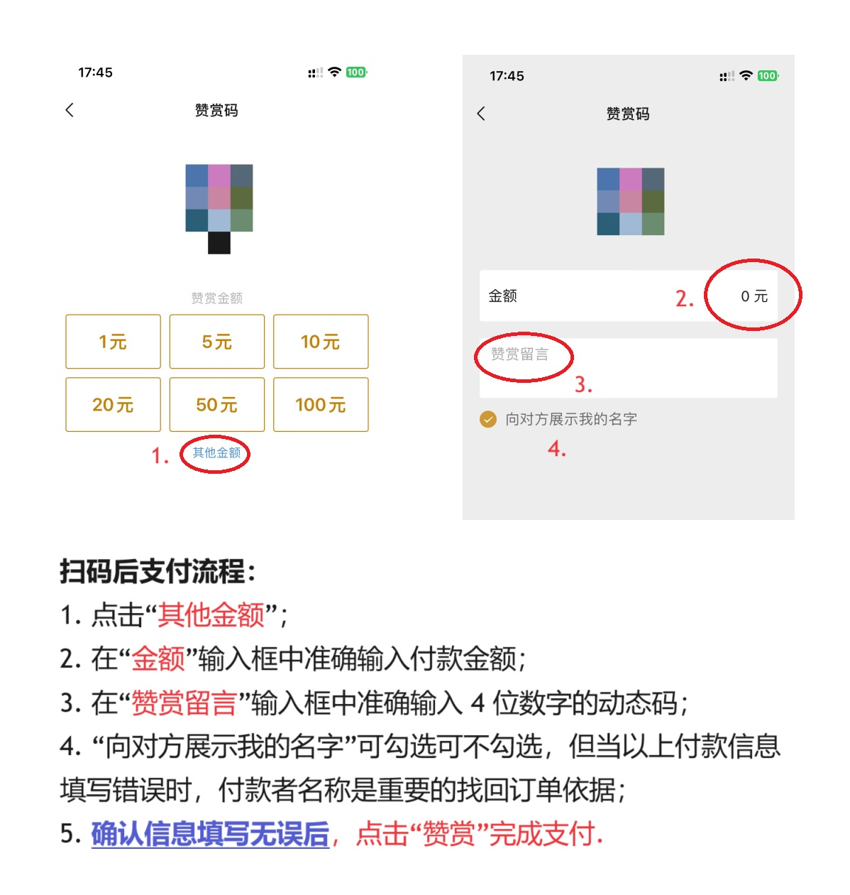

# WPayment 使用文档

v1.0.2 版

## 目录

- [WPayment 使用文档](#wpayment-使用文档)
  - [目录](#目录)
  - [介绍](#介绍)
    - [WPayment 的优点](#wpayment-的优点)
    - [WPayment 的缺点](#wpayment-的缺点)
  - [快速上手](#快速上手)
  - [API](#api)
    - [概览](#概览)
    - [WPayment 类](#wpayment-类)
      - [构造函数](#构造函数)
      - [方法](#方法)
    - [Order 类](#order-类)
      - [构造函数](#构造函数-1)
      - [属性](#属性)
    - [OrderStatus 枚举](#orderstatus-枚举)

## 介绍

众所周知，接入微信支付接口需要商家资质，过程中有严格的审核，还需要缴纳一定的审核费用；审核通过后，微信也会对每笔交易收取一定的手续费. 即使使用其他平台的免签支付，也要缴纳相关费用，且资金安全得不到保证. 而现有的开源免签支付也都是用监控手机端微信通知来实现的，对设备要求高且容易引起风控. 这些解决方案都不适用于个人开发者和较小规模的网站.

于是，WPayment 应运而生. 它基于知名的 [wechaty](https://github.com/wechaty/wechaty) SDK 监听微信消息，而利用赞赏码这一机制实现收款. 赞赏码可以任选金额和自定义备注，这可以方便地用于任意指定小额（单笔赞赏的金额不能超过 200 元）订单的支付，且不需要利用金额来区分不同的用户. 同时，赞赏码设定上就是用于接收来自全国各地网友的赞赏的，所以不像收款码那样容易被风控.

### WPayment 的优点

- 零费率
- 资金通过微信官方渠道流通，避免第三方风险
- 对设备要求低，不需要手机挂机
- 开发方便快捷
- 赞赏码是静态的，可长时间使用，不必频繁刷新
- 被风控的风险低
 
### WPayment 的缺点

- 只能用于小额支付（单笔赞赏的金额不能超过 200 元）
- 对用户有一定的门槛要求，即必须保证其知悉支付方法，并正确输入付款金额和动态码
- 目前只支持 `Node.js`

## 快速上手

使用 npm 安装：
```
npm install --save wpayment
```

基本的使用流程为：
1. 创建一个 `WPayment` 对象，调用 `login()` 方法获取微信登录链接，请自行转化为二维码后用**收款者**的微信登录；
2. 登录后可在需要时调用 `createOrder()` 方法创建订单，记下返回的 `Order` 对象的 `verifyCode` 属性（一个四位数字），并告知用户；
3. 此时，用户可以扫描收款者的**赞赏码**（不是收款码！），**准确无误**地填写付款金额，并在“备注”一栏输入 `verifyCode`，然后支付.
4. 支付完成后，`createOrder()` 方法参数中的 `onPaid()` 回调将会被调用.

收款者调出赞赏码的方法如下：



用户扫描赞赏码后的付款方法：



开发者可直接将此图片展示给用户，作为支付指引.

## API

### 概览

以下文档由 ChatGPT 生成.

`WPayment` 是一个用于处理微信赞赏码支付订单的类，提供了微信登录、创建订单、取消订单、查询订单等功能.

### WPayment 类

#### 构造函数

构造函数用于初始化 `WPayment` 实例. 

#### 方法

1. **login**  
登录收款者微信.

   | 参数名称     | 类型                                 | 功能                | 是否必填 | 默认值 |
   |----------|------------------------------------|-------------------|------|-----|
   | onRequest | `(linkGetter: () => string) => void` | 成功发起登录请求后的回调函数 | 是    | 无   |
   | onSuccess | `() => void`                         | 登录成功后的回调函数     | 是    | 无   |
   | onFail    | `(error: Error) => void`             | 登录失败后的回调函数     | 是    | 无   |

   `onRequest` 回调函数的参数 `linkGetter` 是一个函数，当调用时返回最新的微信扫码登录链接. 

2. **createOrder**  
创建新的订单.

   | 参数名称  | 类型                                 | 功能                  | 是否必填 | 默认值 |
   |-------|------------------------------------|---------------------|------|-----|
   | amount | `string`                             | 订单金额，格式为 "*.xx"  | 是    | 无   |
   | onPaid | `(orderID: string) => void`          | 支付成功后的回调函数    | 是    | 无   |
   | onFail | `(error: Error) => void`             | 支付失败后的回调函数    | 否    | 无   |
   | timeout | `number`                            | 订单超时时间，单位为秒  | 否    | 300 |

   `createOrder` 方法返回一个 `Order` 实例或者 `Error` 对象. 

3. **cancelOrder**
   用于取消一个正处于 `WAITING` 状态的订单.

   | 参数名称  | 类型       | 功能           | 是否必填 | 默认值 |
   |-------|----------|--------------|------|-----|
   | orderID | `string` | 要取消的订单编号 | 是    | 无   |

   方法返回一个布尔值，表示取消操作是否成功. 

4. **queryOrder**
   查询历史订单，支持使用 `orderID` 或 `transID` 进行精确查询，也可以用 `amount` + `payer` / `amount` + `comment` / `amount` + `payer` + `comment` 等方式进行模糊查询. 模糊查询仅能查询到非正常订单，即不含 `OrderID` 的订单，适用于用户支付时错输或漏输验证码/支付金额后，管理员手动查询交易记录的场景.

   | 参数名称  | 类型                                 | 功能                 | 是否必填 | 默认值 |
   |-------|------------------------------------|--------------------|------|-----|
   | onSuccess | `(order: Order \| null) => void`    | 查询成功后的回调函数   | 是    | 无   |
   | onFail    | `(error: Error) => void`            | 查询失败后的回调函数   | 是    | 无   |
   | orderID   | `string`                             | 系统内订单号          | 否    | 无   |
   | payer     | `string`                             | 支付者微信昵称        | 否    | 无   |
   | amount    | `string`                             | 订单金额             | 否    | 无   |
   | comment   | `string`                             | 留言                 | 否    | 无   |
   | transID   | `string`                             | 微信订单号           | 否    | 无   |

    若  `orderID` 和 `transID` 为空，则 `amount` 不能为空，且必须与 `payer` 或 `comment` 组合使用（即后两者不能全为空）.

### Order 类

#### 构造函数

| 名称     | 类型       | 功能        | 是否必填 | 默认值 |
|--------|----------|-----------|------|-----|
| amount | `string` | 订单金额     | 是    | 无   |

#### 属性

| 名称         | 类型         | 功能               |
|------------|------------|------------------|
| orderID    | `string`   | 订单编号           |
| amount     | `string`   | 订单金额           |
| createTime | `Date`     | 订单创建时间         |
| expire     | `Date`     | 订单过期时间         |
| verifyCode | `string`   | 订单验证码          |
| status     | `OrderStatus` | 订单状态           |
| transID    | `string`   | 微信支付的交易编号      |
| onPaid     | `Function` | 支付成功时的回调函数     |
| onFail     | `Function` | 支付失败时的回调函数     |
| paidTime   | `Date`     | 支付时间            |
| payer      | `string`   | 支付者微信昵称         |
| comment    | `string`   | 订单留言            |

### OrderStatus 枚举

| 名称        | 值        | 描述                 |
|-----------|----------|--------------------|
| WAITING   | 'WAITING'  | 等待用户完成支付         |
| SUCCESS   | 'SUCCESS'  | 已完成支付             |
| TIMEDOUT  | 'TIMEDOUT' | 订单超时              |
| CANCELED  | 'CANCELED' | 用户或商家主动取消订单     |
| ERROR     | 'ERROR'    | 遇到错误，订单异常       |
